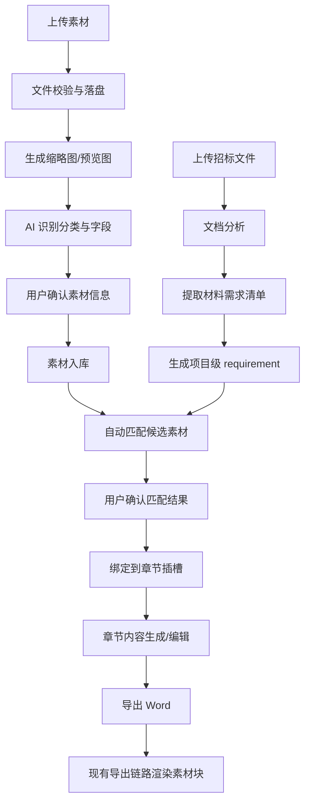

标书智能体 - 素材库功能方案

## 1. 背景与目标

### 1.1 核心诉求

用户上传营业执照、法人证件、资质证书、历史合同、项目案例等企业素材后，系统能够：

1. 对素材进行分类、标签化和有效期管理。
2. 从招标文件中提取“需提供的附件/证件/资质材料”清单。
3. 将需求与素材库中的候选素材进行匹配，并支持人工确认。
4. 在章节内容中插入稳定的素材占位标记。
5. 在现有 DOCX 导出链路中将素材渲染为图片或附件块，而不是新起一套导出系统。

### 1.2 非目标

本方案当前不覆盖：

1. 精确到最终 Word 页码的绝对插入。
2. PDF 附件原样嵌入 Word 作为可翻页对象。
3. 全自动零确认发布。

说明：
“按页码插入”在 Word 动态排版场景下不可稳定保证。本期采用“章节 + 段落锚点”作为可落地方案，导出后页码由 Word 排版自然生成。

### 1.3 成功标准

1. 用户可在 5 分钟内完成 10 份常用素材上传和分类。
2. 招标文件分析后，系统能输出结构化材料需求清单。
3. 对常见证照类材料，自动匹配 Top1 命中率达到可用水平，且允许人工纠正。
4. 导出 Word 后，素材出现在用户确认过的章节位置，格式不破坏现有导出排版。

## 2. 现状与约束

### 2.1 当前系统能力

| 模块 | 现状 |
| --- | --- |
| 知识库 `KnowledgeDoc` | 支持 PDF/DOCX 上传，已有 `scope + owner_id` 范围模型，使用 LlamaIndex + pgvector 向量索引 |
| 章节系统 `Chapter` | 完整三级目录结构，支持 AI 生成与人工编辑 |
| 文档分析 | 已支持项目概述、技术要求类分析 |
| 内容生成 | 已有流式 SSE 生成链路 |
| Word 导出 | 已有 `/api/document/export-word` 导出接口，处理标题、Markdown、字体和层级结构 |

### 2.2 本方案必须遵守的约束

1. 不新起一套独立导出引擎，必须扩展现有 `export-word` 链路。
2. 素材权限模型必须与知识库一致，避免跨用户/跨企业串用。
3. 匹配结果必须支持人工确认，不能直接信任模型输出。
4. MVP 先支持图片和可预览 PDF，复杂附件能力延后。

## 3. 总体设计

### 3.1 架构概览

```text
前端 React
├── 素材库管理页
├── 材料匹配确认面板
├── 章节素材插槽配置面板
└── 导出预览提示

后端 FastAPI
├── Materials Router
├── Material Matching Service
├── Material Recognition Service
├── Material Binding Service
└── Document Export Extension

PostgreSQL
├── material_assets
├── material_requirements
└── chapter_material_bindings

文件存储
├── materials/original
├── materials/preview
└── materials/thumb
```

### 3.2 关键设计原则

1. 素材库是独立资产中心，不直接耦合单个项目。
2. 招标文件识别出的“需求”是项目级数据，允许重复分析、人工修正和重新匹配。
3. 章节中的“插入位置”是显式绑定，不依赖模型在最终导出时临场判断。
4. 导出时只负责渲染已确认的素材块，不再做新的智能决策。

## 4. 数据模型设计

### 4.1 素材范围模型

复用知识库已有设计，采用 `scope + owner_id`：

```python
class Scope(str, enum.Enum):
    GLOBAL = "global"          # 平台全局
    ENTERPRISE = "enterprise"  # 企业私有
    USER = "user"              # 用户私有
```

说明：

1. `scope=user` 时，`owner_id` 指向用户。
2. `scope=enterprise` 时，`owner_id` 指向企业。
3. 查询素材时必须同时按 `scope`、`owner_id`、项目成员权限过滤。

### 4.2 素材主表 `material_assets`

```python
class MaterialCategory(str, enum.Enum):
    BUSINESS_LICENSE = "business_license"
    LEGAL_PERSON_ID = "legal_person_id"
    QUALIFICATION_CERT = "qualification_cert"
    AWARD_CERT = "award_cert"
    ISO_CERT = "iso_cert"
    CONTRACT_SAMPLE = "contract_sample"
    PROJECT_CASE = "project_case"
    TEAM_PHOTO = "team_photo"
    EQUIPMENT_PHOTO = "equipment_photo"
    FINANCIAL_REPORT = "financial_report"
    BANK_CREDIT = "bank_credit"
    SOCIAL_SECURITY = "social_security"
    OTHER = "other"


class MaterialAsset(Base):
    __tablename__ = "material_assets"

    id: UUID
    scope: Scope
    owner_id: UUID
    uploaded_by: UUID | None
    category: MaterialCategory
    name: str
    description: str | None
    file_path: str
    preview_path: str | None
    thumbnail_path: str | None
    file_type: str                    # image/png, image/jpeg, application/pdf
    file_ext: str                     # png, jpg, pdf
    file_size: int
    page_count: int | None
    tags: list[str] | None            # JSONB
    keywords: list[str] | None        # JSONB
    ai_description: str | None
    ai_extracted_fields: dict | None  # JSONB，识别出的证照编号、单位名称、有效期等
    valid_from: date | None
    valid_until: date | None
    is_expired: bool
    review_status: str                # pending / confirmed / rejected
    usage_count: int
    last_used_at: datetime | None
    created_at / updated_at
```

补充说明：

1. `preview_path` 用于 PDF 首图或压缩预览图。
2. `ai_extracted_fields` 用于结构化存储“统一社会信用代码、证书编号、有效期”等字段。
3. `review_status` 表示 AI 建议是否已被用户确认。

### 4.3 项目材料需求表 `material_requirements`

这是本方案新增的关键表，用来保存“从招标文件里识别出的需要提供什么材料”。

```python
class MaterialRequirement(Base):
    __tablename__ = "material_requirements"

    id: UUID
    project_id: UUID
    source_document_id: UUID | None
    chapter_hint: str | None
    section_hint: str | None
    requirement_name: str
    requirement_text: str
    category: str | None
    tags: list[str] | None            # JSONB
    is_mandatory: bool
    status: str                       # pending / matched / missing / ignored / confirmed
    extracted_by: str                 # ai / user
    sort_index: int
    created_at / updated_at
```

### 4.4 章节素材绑定表 `chapter_material_bindings`

不要把复杂绑定直接塞进 `Chapter.material_slots` 一个 JSON 字段里，建议先独立成表，便于查询、审计和版本化。

```python
class ChapterMaterialBinding(Base):
    __tablename__ = "chapter_material_bindings"

    id: UUID
    project_id: UUID
    chapter_id: UUID
    material_requirement_id: UUID | None
    material_asset_id: UUID
    anchor_type: str                  # section_end / paragraph_after / paragraph_before / appendix_block
    anchor_value: str | None          # 如 paragraph_index=3，可序列化存字符串或 JSON
    display_mode: str                 # image / attachment_note
    caption: str | None
    sort_index: int
    created_by: UUID | None
    created_at / updated_at
```

### 4.5 是否要改 `Chapter`

`Chapter` 建议只新增一个轻量字段：

```python
material_marker_enabled: bool = False
```

用途：

1. 标记该章节是否允许自动插入素材占位。
2. 真正的绑定信息仍放在 `chapter_material_bindings` 表中。

## 5. 文件处理设计

### 5.1 支持的文件格式

MVP 支持：

1. `image/png`
2. `image/jpeg`
3. `application/pdf`

处理规则：

1. 图片直接生成缩略图。
2. PDF 生成首页预览图和缩略图。
3. 导出到 Word 时：
   - 图片文件按图片块插入。
   - PDF 文件优先使用首页预览图插入，并在图注中标记“附件预览”。

### 5.2 存储目录建议

```text
uploads/materials/{scope}/{owner_id}/{material_id}/original.ext
uploads/materials/{scope}/{owner_id}/{material_id}/preview.jpg
uploads/materials/{scope}/{owner_id}/{material_id}/thumb.jpg
```

### 5.3 校验要求

1. 内容类型与 magic bytes 双重校验。
2. 单文件大小限制，例如 20MB。
3. 文件名只作为展示用途，落盘使用系统生成路径。
4. 删除素材时，需同时删除预览图与缩略图。

## 6. 业务流程设计

### 6.1 流程总览



### 6.2 流程拆分

#### 流程 A：素材入库

1. 上传文件。
2. 后端生成预览图。
3. AI 输出建议分类、标签、有效期、主体名称等。
4. 用户确认后落库。

#### 流程 B：项目需求提取

1. 招标文件分析时新增“材料需求提取”步骤。
2. 产出项目级 `material_requirements`。
3. 页面展示识别结果，允许用户补充或删除。

#### 流程 C：需求匹配与章节绑定

1. 先根据类别、范围、有效期过滤候选素材。
2. 再用标签、识别字段、名称相似度排序。
3. 用户确认命中素材。
4. 用户选择绑定到哪个章节、以什么锚点插入。

#### 流程 D：导出渲染

1. 导出接口读取章节内容。
2. 在已有 Markdown 渲染流程中解析素材占位标记。
3. 根据 `chapter_material_bindings` 插入图片块和图注。
4. 导出为标准 DOCX。

## 7. AI 识别与匹配设计

### 7.1 上传识别

目标：

1. 给出建议分类。
2. 提取主体名称、证件类型、编号、有效期。
3. 生成标签和描述。

建议输出结构：

```json
{
  "suggested_category": "business_license",
  "description": "XX有限公司营业执照副本",
  "suggested_tags": ["营业执照", "XX有限公司"],
  "extracted_fields": {
    "company_name": "XX有限公司",
    "credit_code": "9131XXXXXXXXXXXX",
    "valid_until": "2028-12-31"
  }
}
```

原则：

1. AI 只做建议，不直接写死最终分类。
2. 识别失败不阻塞上传。

### 7.2 招标文件材料需求提取

不要直接复用现有 `overview/requirements` 二选一接口语义，建议新增一种明确类型：

```python
class AnalysisType(str, Enum):
    OVERVIEW = "overview"
    REQUIREMENTS = "requirements"
    MATERIAL_REQUIREMENTS = "material_requirements"
```

输出结构建议：

```json
{
  "required_materials": [
    {
      "requirement_name": "营业执照副本",
      "category": "business_license",
      "requirement_text": "提供有效期内营业执照副本复印件并加盖公章",
      "chapter_hint": "资格审查",
      "section_hint": "投标人资格证明材料",
      "tags": ["营业执照", "资质证明"],
      "is_mandatory": true
    }
  ]
}
```

### 7.3 匹配策略

匹配不做“一步命中”，改为“两段式”：

#### 第一段：候选召回

过滤条件：

1. 同权限范围内素材。
2. 未过期。
3. 分类相同或在兼容分类集合中。

#### 第二段：排序打分

评分因子建议：

1. 分类完全匹配：+40
2. 主体名称命中：+20
3. 标签命中：+15
4. 关键字段命中：+15
5. 最近使用：+5
6. 用户手动置顶：+5

输出：

1. Top N 候选列表。
2. 默认推荐一条，但必须允许人工改选。

示例伪代码：

```python
async def match_materials(project_id: UUID, requirement_id: UUID) -> list[dict]:
    requirement = await get_requirement(project_id, requirement_id)
    candidates = await recall_candidates(requirement)

    scored = []
    for asset in candidates:
        score = 0
        if asset.category == requirement.category:
            score += 40
        score += match_tags(asset.tags, requirement.tags) * 15
        score += match_subject(asset.ai_extracted_fields, requirement.requirement_text)
        score += recency_bonus(asset.last_used_at)
        scored.append({"asset": asset, "score": score})

    return sorted(scored, key=lambda x: x["score"], reverse=True)[:5]
```

## 8. 章节与导出集成设计

### 8.1 为什么不能新写一个导出器

现有系统已在 `/api/document/export-word` 中处理：

1. 中文字体。
2. Markdown 标题、列表、表格。
3. 项目概述和目录结构渲染。

因此本方案必须扩展现有导出逻辑，而不是重新 `Document()` 拼一份新文档，否则会出现排版分叉。

### 8.2 章节中的占位标记

章节正文允许出现结构化标记：

```text
[INSERT_MATERIAL:binding_id]
```

说明：

1. 这里使用 `binding_id`，不再使用 `category`。
2. 绑定关系在 `chapter_material_bindings` 中维护。
3. 这样可以避免一个章节里出现多个同类材料时无法区分。

### 8.3 导出时的渲染流程

1. 加载项目章节树。
2. 加载该项目全部 `chapter_material_bindings`。
3. 在渲染章节内容时扫描 `[INSERT_MATERIAL:binding_id]`。
4. 根据 `binding_id` 查到素材与图注信息。
5. 将素材渲染为图片块。

伪代码：

```python
MATERIAL_PATTERN = re.compile(r"\[INSERT_MATERIAL:([a-zA-Z0-9-]+)\]")


def render_content_with_materials(doc, content: str, binding_map: dict[str, Binding]) -> None:
    cursor = 0
    for match in MATERIAL_PATTERN.finditer(content):
        text_part = content[cursor:match.start()]
        if text_part.strip():
            add_markdown_content(text_part)

        binding_id = match.group(1)
        binding = binding_map.get(binding_id)
        if binding:
            render_material_block(doc, binding)

        cursor = match.end()

    tail = content[cursor:]
    if tail.strip():
        add_markdown_content(tail)
```

### 8.4 素材块渲染规则

#### 图片素材

1. 默认宽度限制 5.5 英寸。
2. 保持纵横比。
3. 图片下方输出图注。

#### PDF 素材

1. 使用 `preview_path` 插入首图预览。
2. 图注注明“PDF 附件预览”。

#### 缺失素材

1. 不直接报错中断导出。
2. 用醒目的占位文本代替，例如：
   `[素材缺失：营业执照副本]`

## 9. API 设计

### 9.1 素材管理

| 接口 | 方法 | 说明 |
| --- | --- | --- |
| `/api/materials/upload` | POST | 上传单个素材 |
| `/api/materials/batch-upload` | POST | 批量上传素材 |
| `/api/materials` | GET | 列表查询，支持分类、标签、是否过期筛选 |
| `/api/materials/{id}` | GET | 素材详情 |
| `/api/materials/{id}` | PUT | 更新分类、标签、有效期等 |
| `/api/materials/{id}` | DELETE | 删除素材 |

### 9.2 项目需求与匹配

| 接口 | 方法 | 说明 |
| --- | --- | --- |
| `/api/projects/{project_id}/material-requirements/analyze` | POST | 从招标文件重新提取需求 |
| `/api/projects/{project_id}/material-requirements` | GET | 查看材料需求列表 |
| `/api/projects/{project_id}/material-requirements/{id}` | PUT | 人工修正需求 |
| `/api/projects/{project_id}/material-requirements/{id}/match` | POST | 获取候选匹配列表 |
| `/api/projects/{project_id}/material-requirements/{id}/confirm-match` | POST | 确认某个素材为最终匹配 |

### 9.3 章节绑定

| 接口 | 方法 | 说明 |
| --- | --- | --- |
| `/api/projects/{project_id}/chapters/{chapter_id}/material-bindings` | GET | 获取章节素材绑定 |
| `/api/projects/{project_id}/chapters/{chapter_id}/material-bindings` | POST | 新增绑定 |
| `/api/projects/{project_id}/chapters/{chapter_id}/material-bindings/{binding_id}` | PUT | 更新图注、锚点、顺序 |
| `/api/projects/{project_id}/chapters/{chapter_id}/material-bindings/{binding_id}` | DELETE | 删除绑定 |

### 9.4 导出

导出接口不新增新路由，建议扩展现有 `/api/document/export-word` 的请求体，让其支持项目级绑定渲染。

可选方案：

1. 继续沿用前端传 `outline`，但额外传 `project_id`。
2. 更推荐新增项目上下文版本导出接口：
   `/api/projects/{project_id}/export-word`

推荐理由：

1. 可直接从数据库读取最新章节内容和绑定数据。
2. 避免前端本地状态与后端真实状态不一致。

## 10. 前端交互设计

### 10.1 素材库管理页

参考现有 `KnowledgeBase.tsx`，新增能力：

1. 缩略图卡片视图。
2. 分类筛选和关键字搜索。
3. 有效期状态标签。
4. AI 建议待确认提示。

### 10.2 项目匹配面板

在项目工作区新增“材料需求”侧栏：

1. 左侧显示招标文件提取出的材料清单。
2. 中间显示候选素材。
3. 右侧显示绑定章节与插入位置。

### 10.3 章节编辑器

章节内容中支持可视化插入“素材块”：

1. 用户点击“插入素材”。
2. 选择已确认绑定的材料。
3. 编辑器写入 `[INSERT_MATERIAL:binding_id]` 标记。

## 11. 权限与安全

1. 查询素材时，后端根据项目成员身份推导允许访问的 `scope/owner_id` 集合。
2. 不允许前端直接传任意 `owner_id` 作为查询条件。
3. 删除素材前需检查是否已被项目绑定。
4. 已绑定素材删除时，需阻止或给出明确影响提示。

## 12. 错误处理与降级策略

### 12.1 AI 识别失败

降级为普通上传，用户手动填写分类和标签。

### 12.2 需求提取失败

允许用户手动新增材料需求项。

### 12.3 自动匹配失败

状态标记为 `missing`，提示用户补传或手动选材。

### 12.4 导出时素材文件缺失

不终止导出，用占位说明替代，并记录日志。

## 13. 分阶段实施计划

### 阶段一：素材管理 MVP

范围：

1. `material_assets` 表与迁移。
2. 单个/批量上传。
3. 缩略图与 PDF 首图预览。
4. CRUD 页面。
5. 权限隔离。

预计工作量：
3-4 天。

验收标准：

1. 用户可上传图片/PDF 素材。
2. 可按分类与过期状态查询。
3. 素材隔离正确。

### 阶段二：项目需求提取与匹配

范围：

1. `material_requirements` 表与迁移。
2. 新增 `MATERIAL_REQUIREMENTS` 分析类型。
3. 候选召回与排序服务。
4. 匹配确认 UI。

预计工作量：
4-6 天。

验收标准：

1. 项目可生成材料需求列表。
2. 每个需求可查看 Top5 候选。
3. 用户可确认最终素材。

### 阶段三：章节绑定与导出集成

范围：

1. `chapter_material_bindings` 表与迁移。
2. 章节插入标记。
3. 扩展现有 Word 导出。
4. 缺失素材降级渲染。

预计工作量：
4-6 天。

验收标准：

1. 章节内可插入已绑定素材。
2. 导出后图片、图注和正文顺序正确。
3. 不破坏现有 Word 排版。

## 14. 测试建议

### 14.1 后端测试

1. 文件类型校验。
2. 权限隔离。
3. PDF 预览图生成。
4. 匹配排序逻辑。
5. 导出时占位符解析与图片插入。

### 14.2 前端测试

1. 上传与预览。
2. 匹配确认流程。
3. 章节插入素材标记。

### 14.3 人工验收样例

至少准备以下真实样例：

1. 营业执照 JPG
2. 法人身份证 PNG
3. 资质证书 PDF
4. 历史合同 PDF
5. 一个要求附件材料较多的真实招标文件

## 15. 最终建议

1. 先做“素材库 + 项目需求 + 人工确认绑定”，这是最短闭环。
2. AI 自动识别和自动匹配都应定位为“提效”，不是“替用户做最终决定”。
3. 导出必须建立在现有导出链路之上扩展，避免双轨维护。
4. 页码级精确落位不应纳入本期承诺，避免交付预期失真。

[!TIP]
建议按“先资产管理、再项目匹配、最后导出闭环”的顺序推进。这样每一阶段都能独立验收，也能尽早给用户提供可用价值。
